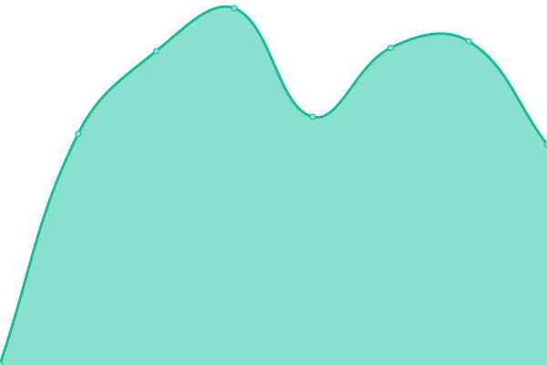
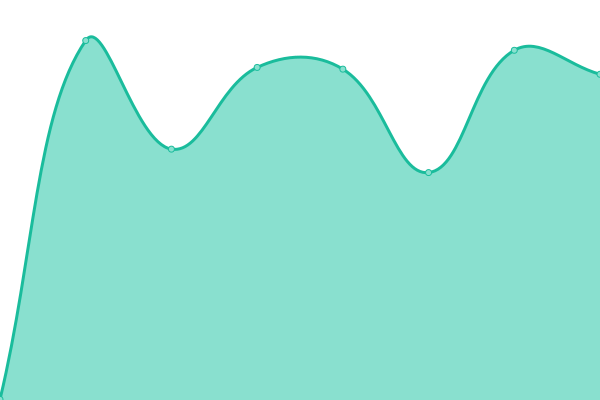

# [📈 Live Status](https://status.kitsune.tv): <!--live status--> **🟩 All systems operational**

This repository contains the open-source uptime monitor and status page for [Kitsune](https://kitsune.tv/), powered by [Upptime](https://github.com/upptime/upptime).

With [Upptime](https://upptime.js.org), you can get your own unlimited and free uptime monitor and status page, powered entirely by a GitHub repository. We use [Issues](https://github.com/KitsuneTV/Status/issues) as incident reports, [Actions](https://github.com/KitsuneTV/Status/actions) as uptime monitors, and [Pages](https://status.kitsune.tv) for the status page.

<!--start: status pages-->
<!-- This summary is generated by Upptime (https://github.com/upptime/upptime) -->
<!-- Do not edit this manually, your changes will be overwritten -->
<!-- prettier-ignore -->
| URL | Status | History | Response Time | Uptime |
| --- | ------ | ------- | ------------- | ------ |
|  [Osaka (Website)](https://kitsune.tv/) | 🟩 Up | [osaka-website.yml](https://github.com/KitsuneTV/Status/commits/HEAD/history/osaka-website.yml) | 

 714ms
     
 | 

<a href="https://status.kitsune.tv/history/osaka-website">100.00%</a>
    

|  [Osaka Beta (Beta Website)](https://beta.kitsune.tv/) | 🟩 Up | [osaka-beta-beta-website.yml](https://github.com/KitsuneTV/Status/commits/HEAD/history/osaka-beta-beta-website.yml) | 

 268ms
     
 | 

<a href="https://status.kitsune.tv/history/osaka-beta-beta-website">100.00%</a>
    

|  [Kyoto (API)](https://kyoto.kitsune.tv/) | 🟩 Up | [kyoto-api.yml](https://github.com/KitsuneTV/Status/commits/HEAD/history/kyoto-api.yml) | 

 350ms
     
 | 

<a href="https://status.kitsune.tv/history/kyoto-api">100.00%</a>
    

|  [Neyagawa (Search)](https://neyagawa.kitsune.tv/) | 🟩 Up | [neyagawa-search.yml](https://github.com/KitsuneTV/Status/commits/HEAD/history/neyagawa-search.yml) | 

 342ms
     
 | 

<a href="https://status.kitsune.tv/history/neyagawa-search">100.00%</a>
    

|  [Kyushu (Analytics)](https://kyushu.kitsune.tv/) | 🟩 Up | [kyushu-analytics.yml](https://github.com/KitsuneTV/Status/commits/HEAD/history/kyushu-analytics.yml) | 

 628ms
     
 | 

<a href="https://status.kitsune.tv/history/kyushu-analytics">100.00%</a>
    

|  [Sakai (Poster Proxy)](https://sakai.kitsune.tv/) | 🟩 Up | [sakai-poster-proxy.yml](https://github.com/KitsuneTV/Status/commits/HEAD/history/sakai-poster-proxy.yml) | 

 356ms
     
 | 

<a href="https://status.kitsune.tv/history/sakai-poster-proxy">100.00%</a>
    

<!--end: status pages-->

[**Visit our status website →**](https://status.kitsune.tv)

## 📄 License

- Powered by: [Upptime](https://github.com/upptime/upptime)
- Code: [MIT](./LICENSE) © [Kitsune](https://kitsune.tv/)
- Data in the `./history` directory: [Open Database License](https://opendatacommons.org/licenses/odbl/1-0/)
